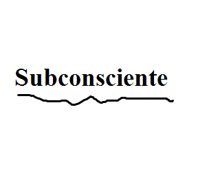

# Subconsciente

Martin, un chico que ha estado teniendo problemas para abrirse socialmente en su nuevo barrio, se adentrara
a las profundidades de su mente con la ayuda de su psicologo, para descubrir porque se ha estado cerrando hacia los demas. 

Encuentra maneras de evadir trampas y defenderte de los protectores de la mente de Martin, que buscan evitar que baje
hasta su subconsciente, y escucha los consejos del psicologo para poder encontrar que secretos esconde las profundidades
de su cabeza.

This is a game (demo/protoype/vertical slice) developed by students from <a href="https://www.imagecampus.edu.ar/">Image Campus</a>

   

## Credits

- **Diaz Klipphan Rodrigo** - *Programming* -   
- **Leiva Ignacio** - *Programming* -     

This game was also possible thanks to the support of these professors:

- **Roy Magariños**
- **Andrés Vergez**

## Links

Download it from itch.io: https://hollowriter.itch.io/subsconsciente
